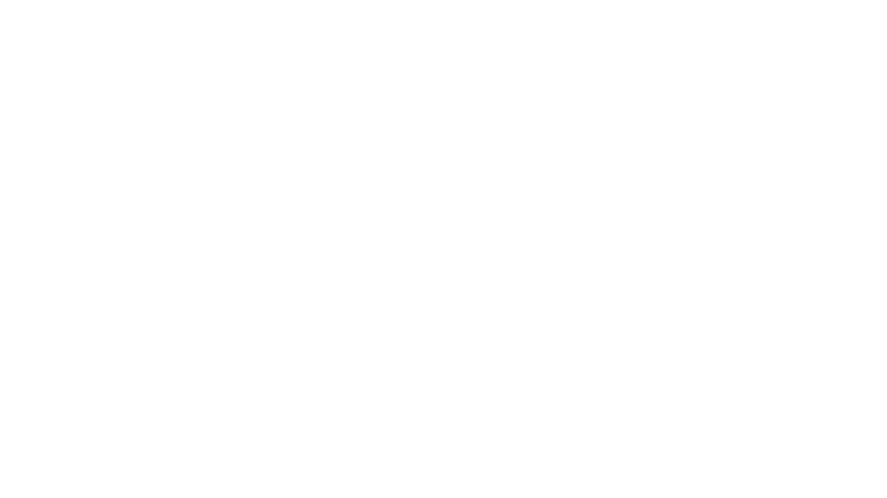

<style>
    *{color:#B2ECFB;}
    h1{color:white;}
    h2{color:dodgerblue;}
    h1 span{color:dodgerblue;}
    img{height:2.5rem}
    .flex{display:flex;}
    .bg{background-color:#0D1116}
</style>
<div class="bg">

<div class="flex">
    <h1>Visual<span>DOM</span></h1>
    
</div>

*A visual representation of the Document Object Model to aid in web development.*

## Features

- Visualize nested children in your HTML
- Each node provides the element's ID and tag name
- Managing 100+ `<div>`s has never been this easy!

## How to use this in your project

1. Download and extract .zip
2. Place 'package' directory in the root of your project
3. Add vdom.js `<script>` tag to end of `<body>` (immediately before closing tag)  
```<script src="./package/vdom.js"></script>```
5. Build out your project, and VisualDOM will render additional elements in the `<body>` below your markup!
6. Done with VisualDOM? Remove the `<link>` and `<script>` tags associated with VisualDOM, and remove 'package' directory from your project.

</div>
